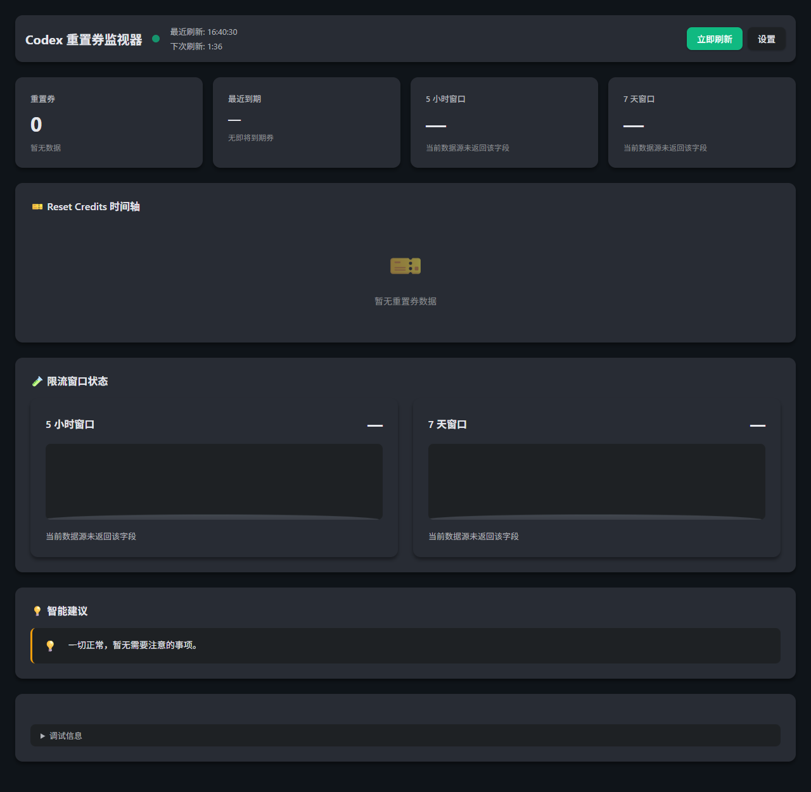

# Codex 重置券监视器

Codex Reset Watcher 是一个轻量 Windows 桌面应用，用来把 Codex 重置券、5 小时窗口、7 天窗口和使用建议可视化。它只读取你本机配置的 Codex-Usage 脚本输出，不上传数据，不同步云端。

**v0.1.0** 是首个公开发布版本。核心查看与刷新流程可用，但部分设置项目前仅保存、尚未完全生效（见下方「当前限制」）。

## 为什么需要这个工具

Codex 的额度信息通常分散在命令输出、日志或网页提示里。临近到期的重置券、5 小时窗口、7 天窗口如果不放在同一个界面里，很容易错过可用额度或在关键任务前才发现窗口偏紧。

这个工具的目标很简单：把“还剩什么、多久过期、现在该不该继续用”放到一个可扫视的面板里。

## 主要功能

- 🎫 **重置券时间轴**：按到期状态展示每张重置券
- 🧪 **液柱仪表盘**：展示 5 小时和 7 天窗口剩余额度
- 💡 **智能建议**：根据临期券和窗口剩余比例给出提醒
- 🌍 **多语言界面**：支持 zh-CN / en / ja / zh-TW
- 🔒 **本地优先**：配置和日志都保存在本机，日志会脱敏

## 使用场景

- 开始长时间编码前，确认 5 小时窗口是否充足
- 每天打开电脑后，检查是否有重置券即将到期
- 在周额度紧张时，提前安排高成本任务
- 给自己保留一个可视化、可解释的 Codex 用量面板

## 截图




## 快速开始

### 方式 A：下载 Release 安装包

1. 从 [Releases](https://github.com/water04not-speak/codex-reset-watcher/releases) 页面下载最新 Windows 版本。
2. 运行 `codex-reset-watcher.exe`，或安装 MSI/NSIS 安装包。
3. 点击「设置」，填写：
   - Python 路径
   - Codex-Usage 脚本路径
   - 刷新间隔（最小 60 秒）
4. 点击「立即刷新」。

### 方式 B：从源码运行

前置条件：Windows 10/11、Node.js 18+、Rust stable、Python 3.x。

```bash
git clone https://github.com/water04not-speak/codex-reset-watcher.git
cd codex-reset-watcher
npm ci
npm run tauri dev
```

常用检查：

```bash
npm run typecheck
npm run lint
npm run build
npm run verify:mock
```

### 没有真实 Codex-Usage 脚本时如何试用

项目内置 mock 数据源，仅用于验证界面和安装流程：

```bash
python examples/mock-codex-usage.py all --json
```

在「设置」中填写：

- **Python 路径**：`python`
- **脚本路径**：`C:\path\to\codex-reset-watcher\examples\mock-codex-usage.py`

然后点击「立即刷新」。

- mock 数据不能代替真实额度查询。
- 真实数据仍需要你本机的 Codex-Usage 脚本。
- 应用不会读取 `auth.json`、token 或 cookie。

### 配置示例

```json
{
  "codexUsagePath": "C:\\path\\to\\codex_usage.py",
  "pythonCommand": "python",
  "refreshIntervalSeconds": 120,
  "autoStart": false,
  "alwaysOnTop": false,
  "startMinimized": false,
  "language": "zh-CN",
  "theme": "dark",
  "commandTimeoutSeconds": 25
}
```

配置文件保存在 `%APPDATA%/com.codex-reset-watcher/config.json`。

### 从源码构建

前置条件：

- Windows 10/11
- Node.js 18+
- Rust stable 工具链
- Python 3.x（运行时读取你配置的数据源脚本）

```bash
npm ci
npm run lint
npm run typecheck
npm run build
npm run tauri build
```

Windows 安装包输出路径：

- `src-tauri/target/release/bundle/msi/*.msi`
- `src-tauri/target/release/bundle/nsis/*.exe`

v0.1.0 的安装包尚未签名。

## 常见问题

### 为什么没有数据显示？

先打开设置，确认 Python 路径和脚本路径正确。脚本需要能通过命令行输出 JSON；如果脚本超时或返回空内容，界面会显示错误提示。

### 会保存 auth.json、token 或 cookie 吗？

不会。应用只保存用户配置，不保存认证文件、token、cookie 或 API key。日志写入前会做脱敏。

### 主题里的 light 为什么没有切换效果？

第一版只保存主题偏好，实际浅色主题还未实现。这个字段是为了后续 UI 切换预留。

### 开机自启和窗口置顶会立即生效吗？

第一版只保存这两个选项。Rust 侧系统能力还未接入，因此它们目前是占位配置。

### `startMinimized` 为什么没在设置里看到？

第一版只在配置文件中保留该字段，设置面板尚未暴露，Rust 侧也尚未接入对应行为。

## 数据来源

应用只读取你本机配置的 Codex-Usage 脚本输出，不会上传数据。JSON 字段说明见 [docs/DATA_SOURCE.md](docs/DATA_SOURCE.md)。

## 当前限制

v0.1.0 聚焦本地可视化与刷新，以下能力尚未完整实现：

- **浅色主题**：仅保存偏好，界面仍使用深色主题。
- **开机自启**、**窗口置顶**：设置项可保存，Rust 宿主尚未应用。
- **`startMinimized`**：仅存在于配置文件中，设置面板未暴露。
- **系统托盘**：尚未提供。
- **安装包签名**：v0.1.0 的 Windows 安装包未签名。

## 路线图

- 提供已签名的 Windows 安装包
- 在 Rust 宿主中接入开机自启、置顶、最小化启动
- 增加系统托盘
- 实现浅色主题渲染
- 完善首次使用说明与 Release 说明

## 安全与隐私

详见 [SECURITY.md](SECURITY.md) 和 [docs/PRIVACY.md](docs/PRIVACY.md)。

## 许可证

MIT © 2026
